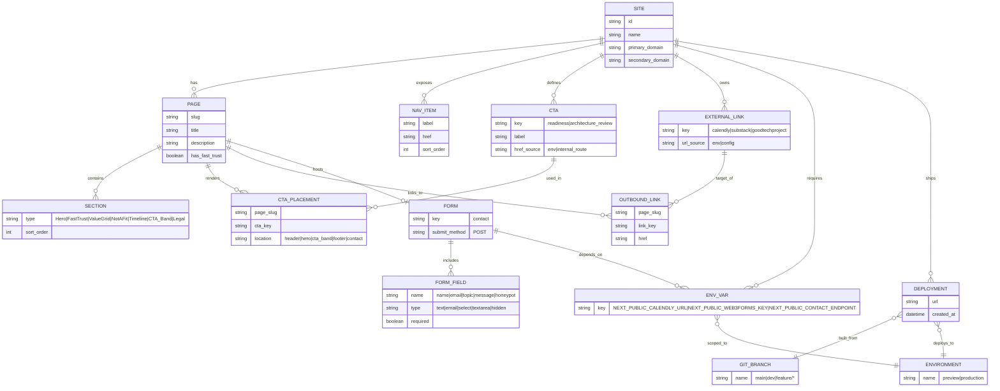

# Ancient Labs V1 Marketing Site — Entity Relationship Diagram

This ERD represents the Ancient Labs V1 marketing site as a **content + wiring system**. Unlike traditional database ERDs, this diagram models the site's structure: pages, CTAs, external integrations, environment variables, and deployment configurations. It documents how content flows through the site and how external services are wired via environment variables.

## ERD Diagram

## Mapping to Locked Decisions

### Global CTAs (2 Total)
- **`readiness`**: "Book AI Readiness Call" → wired via `NEXT_PUBLIC_CALENDLY_URL` (env-driven)
- **`architecture_review`**: "Request Architecture Review" → routes to `/contact#architecture-review` (internal route)

Both CTAs are defined in `siteConfig.ts` and placed across pages via `CTA_PLACEMENT` (header, hero, CTA band, footer).

### Environment-Driven Wiring
- **Calendly**: `NEXT_PUBLIC_CALENDLY_URL` → used by `readiness` CTA
- **Web3Forms**: `NEXT_PUBLIC_WEB3FORMS_KEY` → used by contact form submission
- **Contact Endpoint**: `NEXT_PUBLIC_CONTACT_ENDPOINT` → form POST target

All external integrations are configured via environment variables (no hardcoded URLs or keys).

### Pages/Routes
The site exposes 8 routes:
- `/` (Home)
- `/services`
- `/payments`
- `/process`
- `/about`
- `/contact` (includes form)
- `/insights`
- `/privacy`

Each `PAGE` contains multiple `SECTION` types (Hero, FastTrust, ValueGrid, NotAFit, Timeline, CTA_Band, Legal) and renders CTAs via `CTA_PLACEMENT`.

### Preview vs Production
- **Production**: `main` branch → deploys to `ancientlabs.co` (primary domain)
- **Preview**: PR/branch deployments → Vercel preview URLs

`DEPLOYMENT` entities track which `GIT_BRANCH` built them and which `ENVIRONMENT` they target. `ENV_VAR` values are scoped per `ENVIRONMENT` (preview can use test endpoints; production uses live endpoints).
